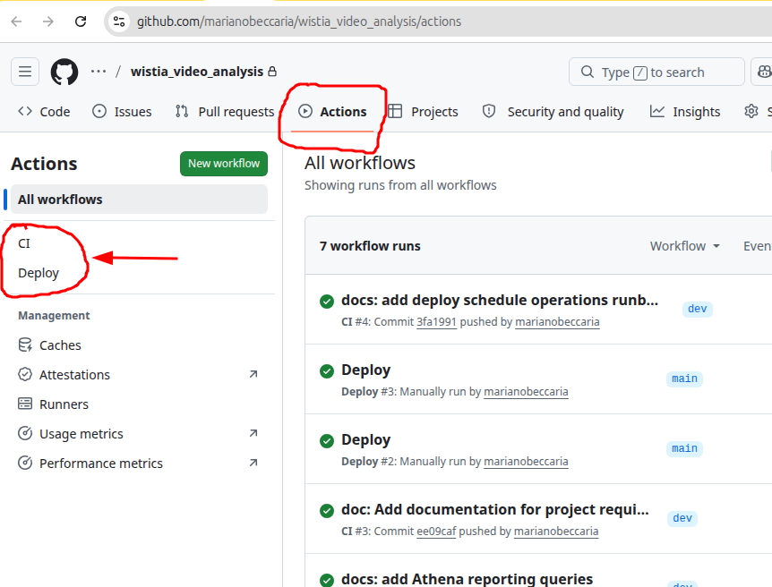

# Wistia Video Analysis

## Project Summary

This project delivers an end-to-end Wistia video analytics solution that ingests Wistia API data, stores it in a structured data lake, transforms it into analytics-ready tables, and presents the results through a deployed dashboard application.

The solution focuses on analyzing video performance across selected Wistia media assets, including media metadata, play activity, engagement, visitor-level behavior, watch time, and date-based performance trends. Raw API responses are preserved for traceability, then refined into silver and gold datasets that support reporting, validation, and dashboard consumption.

The operational platform is designed to be reproducible and production-ready. The dashboard application is deployed on AWS EC2, deployment is automated with GitHub Actions, AWS authentication uses OIDC instead of long-lived credentials, and operational access is centralized through AWS Systems Manager rather than direct SSH.

At a high level, the project combines:

* Wistia data ingestion from API endpoints
* Bronze, silver, and gold data lake layers
* PySpark-based transformations into dimensional analytics tables
* Data quality validation for gold outputs
* Dashboard deployment on AWS infrastructure
* CI/CD automation through GitHub Actions
* Secure AWS operations through OIDC and SSM

## Recommended Architecture

AWS is recommended for this project:

### Ingestion

* Python ingestion app calls Wistia APIs.
* Target media IDs: gskhw4w4lm, v08dlrgr7v.
* Pull:
  * media metadata
  * media stats
  * media engagement
  * visitor-level stats
  * date-range analytics where useful
* Store raw JSON responses in S3 bronze storage.

### Storage

* S3 data lake:
  * `bronze/wistia/...`
  * `silver/wistia/...`
  * `gold/wistia/...`

* Use Parquet for silver/gold layers.
* Use AWS Glue Data Catalog + Athena for query access.

### Transformation

* Use PySpark, likely AWS Glue Spark jobs.
* No dbt, per requirement.
* Transform raw API responses into:
  * `dim_media`
  * `dim_visitor`
  * `fact_media_engagement`
* Add audit fields like ingested_at, source_file, pipeline_run_id.

### Orchestration

* Use AWS Glue Workflow to coordinate the pipeline.
* Use a Glue scheduled trigger for automatic daily runs when enabled.
* The workflow runs:
  * ingest raw bronze data
  * transform bronze to silver
  * transform silver to gold
  * validate gold tables
* Run daily for 7 consecutive days.

### CI/CD

* Initialize GitHub repo. I checked locally and this folder is not currently a Git repository.
* GitHub Actions should run:
  * Python linting
  * unit tests
  * security checks for secrets
  * package validation
  * optional Terraform/IaC validation
* Deploy AWS resources and jobs through GitHub Actions.

### Reporting

* Use Athena + QuickSight for dashboarding.
* Optional local/dashboard folder can hold dashboard notes, screenshots, or export definitions.
* Main KPIs:
  * plays by media/channel/date
  * play rate
  * total watch time
  * average watched percent
  * unique visitors
  * visitor country/IP distribution
  * Facebook vs YouTube comparison

7-day production run log results will be update here: [Production Run Logs](docs/production_run_log.md)

## Local Runbook

### Prerequisites

Use the `dea-cdk` conda environment with Python 3.11.

```bash
conda activate dea-cdk
python --version
```

Install project dependencies if needed:

```bash
python -m pip install -r requirements.txt
```

Create a local `.env` or `infrastructure/.env` file with the Wistia API token. Do not commit this file.

```env
WISTIA_API_TOKEN=replace_with_real_token
```

### Run The Local Pipeline

Run raw bronze ingestion for the default daily window:

```bash
python -m src.ingestion.ingest_wistia_raw
```

Run raw bronze ingestion for a specific date window:

```bash
WISTIA_START_DATE=2026-05-03 WISTIA_END_DATE=2026-05-04 python -m src.ingestion.ingest_wistia_raw
```

For historical exploration only, use a wider date window. This can take several minutes because visitor-level event pagination may return many pages.

```bash
WISTIA_START_DATE=2024-01-01 WISTIA_END_DATE=2026-05-04 python -m src.ingestion.ingest_wistia_raw
```

Transform bronze JSON to silver Parquet:

```bash
python -m src.transforms.bronze_to_silver
```

Transform silver Parquet to gold dimensional tables:

```bash
python -m src.transforms.silver_to_gold
```

Run gold data quality checks:

```bash
python -m src.quality.check_gold
```

### Local Data Outputs

The local pipeline writes data to these ignored folders:

```txt
data/bronze/wistia/
data/silver/wistia/
data/gold/wistia/
```

Bronze contains raw JSON API payloads wrapped with ingestion metadata. Silver contains cleaned source-aligned Parquet tables. Gold contains dimensional tables for analytics:

```txt
data/gold/wistia/dim_media/
data/gold/wistia/dim_visitor/
data/gold/wistia/fact_media_engagement/
```

### Validation Commands

Check local data sizes:

```bash
du -sh data/bronze/wistia data/silver/wistia data/gold/wistia
```

Check row counts and schemas:

```bash
python - <<'PY'
from pyspark.sql import SparkSession

spark = SparkSession.builder.appName("wistia-local-check").getOrCreate()

for layer, tables in {
    "silver": ["media_metadata", "media_stats", "media_stats_by_date", "media_engagement", "events", "visitor_stats"],
    "gold": ["dim_media", "dim_visitor", "fact_media_engagement"],
}.items():
    for table in tables:
        path = f"data/{layer}/wistia/{table}"
        df = spark.read.parquet(path)
        print(layer, table, df.count())
        df.printSchema()

spark.stop()
PY
```

## AWS Runbook

### Deploy Infrastructure

Use the `dea-cdk` conda environment and deploy from the `infrastructure` folder.

```bash
conda activate dea-cdk
cd infrastructure
```

Create `infrastructure/.env` from `infrastructure/.env.example`, then fill in the AWS account, region, bucket name, and other environment-specific values. Do not commit `infrastructure/.env`.

```bash
cp .env.example .env
```

Synthesize and deploy the stack:

```bash
cdk synth
cdk deploy
```

The deployment creates or references the S3 data lake bucket, creates the Wistia API token secret, uploads the Glue scripts/config, creates Glue jobs, creates the Glue workflow, and registers explicit Glue catalog tables for the gold layer.

### Set Wistia Secret

After the stack creates the secret, update it with the real Wistia API token. `read -s` lets you type the token without echoing it to the terminal, and `unset` removes the shell variable after the update.

```bash
read -s -p "Wistia token: " WISTIA_TOKEN
echo
aws secretsmanager put-secret-value \
  --secret-id /wistia-video-analysis/dev/wistia-api-token \
  --secret-string "{\"token\":\"$WISTIA_TOKEN\"}"
unset WISTIA_TOKEN
```

Verify that the secret exists without printing the token value:

```bash
aws secretsmanager describe-secret \
  --secret-id /wistia-video-analysis/dev/wistia-api-token
```

### Start Workflow

Run the full pipeline manually through Glue Workflow:

```bash
aws glue start-workflow-run \
  --name wistia-video-analysis-dev-workflow
```

The workflow runs the jobs in this order:

```txt
wistia-video-analysis-dev-ingest-bronze
wistia-video-analysis-dev-bronze-to-silver
wistia-video-analysis-dev-silver-to-gold
wistia-video-analysis-dev-gold-quality
```

Automatic scheduling is controlled by `PIPELINE_SCHEDULE` and `PIPELINE_SCHEDULE_ENABLED` in `infrastructure/.env`. Keep `PIPELINE_SCHEDULE_ENABLED=false` for manual development runs.

### Monitor Workflow

Check the latest workflow run:

```bash
aws glue get-workflow-runs \
  --name wistia-video-analysis-dev-workflow \
  --max-results 1 \
  --include-graph \
  --query 'Runs[0].{RunId:WorkflowRunId,Status:Status,Started:StartedOn,Completed:CompletedOn}' \
  --output table
```

Inspect the job-level status for a specific workflow run:

```bash
RUN_ID=$(aws glue get-workflow-runs \
  --name wistia-video-analysis-dev-workflow \
  --max-results 1 \
  --query 'Runs[0].WorkflowRunId' \
  --output text)

aws glue get-workflow-run \
  --name wistia-video-analysis-dev-workflow \
  --run-id "$RUN_ID" \
  --include-graph \
  --query 'Run.Graph.Nodes[?Type==`JOB`].{Job:Name,Status:JobDetails.JobRuns[0].JobRunState,Started:JobDetails.JobRuns[0].StartedOn,Completed:JobDetails.JobRuns[0].CompletedOn,Error:JobDetails.JobRuns[0].ErrorMessage}' \
  --output table
```

The workflow is successful when all four jobs show `SUCCEEDED` and the workflow status is `COMPLETED`.

### Verify S3 Outputs

Set the bucket name for the current shell:

```bash
BUCKET_NAME=<your-s3-bucket-name>
```

Check bronze, silver, and gold outputs:

```bash
aws s3 ls "s3://${BUCKET_NAME}/bronze/wistia/" --recursive | head
aws s3 ls "s3://${BUCKET_NAME}/silver/wistia/" --recursive | head
aws s3 ls "s3://${BUCKET_NAME}/gold/wistia/" --recursive | head
```

Expected gold folders:

```txt
gold/wistia/dim_media/
gold/wistia/dim_visitor/
gold/wistia/fact_media_engagement/
```

`fact_media_engagement` is partitioned by `date` and `media_id`, so S3 paths look like:

```txt
gold/wistia/fact_media_engagement/date=YYYY-MM-DD/media_id=<wistia-media-id>/
```

### Query Athena

Use the Athena console and select the Glue database:

```txt
wistia_video_analytics
```

Smoke test the gold tables:

```sql
SELECT *
FROM wistia_video_analytics.dim_media
LIMIT 10;
```

```sql
SELECT *
FROM wistia_video_analytics.dim_visitor
LIMIT 10;
```

```sql
SELECT *
FROM wistia_video_analytics.fact_media_engagement
LIMIT 10;
```

Example KPI query:

```sql
SELECT
    f.date,
    m.channel,
    f.media_id,
    SUM(f.play_count) AS plays,
    AVG(f.watched_percent) AS avg_watched_percent,
    SUM(f.total_watch_time_hours) AS total_watch_time_hours
FROM wistia_video_analytics.fact_media_engagement f
JOIN wistia_video_analytics.dim_media m
    ON f.media_id = m.media_id
GROUP BY
    f.date,
    m.channel,
    f.media_id
ORDER BY
    f.date DESC,
    m.channel,
    f.media_id;
```

The explicit Glue tables point Athena directly at the gold Parquet data in S3. After each successful workflow run, Athena reads the newly written gold files without requiring a crawler run.

For more information about Athenas queries for this project see: [Athena Reporting Queries](docs/athena_reporting_queries.md)

## CI/CD

The repository includes GitHub Actions workflows under `.github/workflows`.

`ci.yml` runs on pushes and pull requests to validate:

- Python syntax compilation
- optional pytest tests when present
- CDK synth

`deploy.yml` is a manual deployment workflow. It uses GitHub Actions OIDC to assume an AWS deployment role, then runs `cdk synth` and `cdk deploy`.

Once these workflows are generated, they should show under *Actions* on the repository Menu:



Required GitHub secret for deployment:

```txt
AWS_DEPLOY_ROLE_ARN
```

## Requirements Traceability - Architecured Implemented

This section maps the Wistia Video Analytics project requirements to the implemented code, infrastructure, documentation, and AWS artifacts.

### Summary

| ID | Requirement | Status | Implementation / Evidence |
|---|---|---|---|
| FR1 | Design your own architecture for ingestion, processing, and storage | Complete | Architecture documented in `README.md`. Implemented with S3 bronze/silver/gold layers, Glue jobs, Glue Workflow, Secrets Manager, Glue Catalog, and Athena. |
| FR2 | Authenticate to Wistia Stats API using token-based Basic Auth | Complete | `src/ingestion/wistia_client.py` supports configurable auth and uses Basic Auth from `config/pipeline.yml`. Token is read from local env for local runs or AWS Secrets Manager for Glue runs. |
| FR3 | Extract media metadata such as title, ID, hashed ID, created_at | Complete | `src/ingestion/ingest_wistia_raw.py` extracts media metadata from `/medias`. `src/transforms/bronze_to_silver.py` maps metadata to silver columns such as `media_id`, `wistia_numeric_id`, `title`, `created_at`, and `updated_at`. |
| FR4 | Extract engagement metrics such as plays, play rate, watch time | Complete | Ingestion extracts media stats, media stats by date, and engagement arrays. Silver/gold transforms expose `play_count`, `play_rate`, `hours_watched`, `total_watch_time_hours`, `watched_percent`, and related metrics. |
| FR5 | Extract visitor-level data such as IP and engagement events | Complete with privacy handling | Bronze stores raw event payloads from `/stats/events` and visitor stats from `/stats/visitors/{visitor_key}`. Silver/gold expose visitor engagement, location, browser, platform, and hashed visitor IDs while intentionally excluding raw IP, email, and visitor identity fields. |
| FR6 | Implement pagination to fetch all pages of results | Complete | `src/ingestion/ingest_wistia_raw.py` paginates event extraction with `page` and `per_page` until Wistia returns an empty or short page. |
| FR7 | Implement incremental ingestion based on created_at/updated_at | Complete | `src/ingestion/watermark.py` persists an incremental watermark to local/S3 state. `src/ingestion/ingest_wistia_raw.py` resolves the next incremental date window and updates the watermark only after successful ingestion. |
| FR8 | Run this pipeline in production mode for 7 consecutive days | In progress | AWS Glue scheduled trigger is enabled for daily runs. Evidence should be recorded in `docs/production_run_log.md` for 7 consecutive successful workflow runs. |
| FR9 | Implement a CI/CD pipeline using GitHub Actions or equivalent | Complete | `.github/workflows/ci.yml` validates Python and CDK. `.github/workflows/deploy.yml` provides manual CDK deploy through GitHub OIDC. Setup is documented in `docs/github_actions_manual_deploy_setup.md`. |
| FR10 | Store results in a structured data model, DWH, or cloud database | Complete | Gold dimensional model is written to S3 as Parquet and registered in Glue Catalog for Athena: `dim_media`, `dim_visitor`, and `fact_media_engagement`. |
| FR11 | Create final reports or dashboards for insights | Complete as Athena reporting queries | `docs/athena_reporting_queries.md` contains Athena queries for plays, watch time, watched percent, unique visitors, Facebook vs YouTube comparison, location, and device/platform breakdown. |
| FR12 | Submit a GitHub repo with documentation, pipeline code, CI/CD setup, and instructions | Complete pending final push/review | Repository contains pipeline code, CDK infrastructure, CI/CD workflows, README runbooks, reporting queries, deployment setup docs, and this requirements traceability document. |

### Architecture Artifacts

- `README.md`: recommended architecture, local runbook, AWS runbook, and operational commands.
- `infrastructure/wistia_video_analysis_stack.py`: CDK stack for S3, Secrets Manager, Glue role, Glue database, Glue jobs, Glue Workflow, triggers, and explicit Glue tables.
- `config/pipeline.yml`: pipeline configuration for Wistia API endpoints, media/channel mapping, ingestion settings, storage prefixes, and table names.

### Pipeline Code Artifacts

- `src/ingestion/wistia_client.py`: Wistia API client with authentication, timeout handling, retries, status-code handling, and logging.
- `src/ingestion/ingest_wistia_raw.py`: bronze ingestion for media metadata, media stats, engagement, date-based stats, events, and visitor stats.
- `src/ingestion/watermark.py`: persisted incremental watermark state and incremental window resolution.
- `src/transforms/bronze_to_silver.py`: Spark transform from raw bronze JSON to cleaned silver Parquet tables.
- `src/transforms/silver_to_gold.py`: Spark transform from silver tables to gold dimensional model.
- `src/quality/check_gold.py`: gold data quality checks.

### Data Model Artifacts

Gold tables:

```txt
dim_media
dim_visitor
fact_media_engagement
```

The gold layer is stored in:

```txt
s3://mbeccaria-dea-wistia-analytics/gold/wistia/
```

Athena queries these tables through the Glue database:

```txt
wistia_video_analytics
```

### CI/CD Artifacts

- `.github/workflows/ci.yml`: validates Python compilation, optional tests, and CDK synth.
- `.github/workflows/deploy.yml`: manually deploys the CDK stack through GitHub Actions OIDC.
- `docs/github_actions_manual_deploy_setup.md`: documents reusable setup steps for GitHub OIDC and the AWS deploy role.

### Reporting Artifacts

- `docs/athena_reporting_queries.md`: Athena SQL reporting queries for project insights.
- Athena console: used to validate the explicit Glue gold tables and run business queries.

### Production Run Evidence

FR8 requires 7 consecutive successful production runs. Track those runs in:

```txt
docs/production_run_log.md
```

To see 7-day production run log results: [Production Run Logs](docs/production_run_log.md)

For each run, capture:

- workflow run ID
- workflow status
- start and completion timestamps
- job-level status for all Glue jobs
- latest watermark value
- optional S3/Athena evidence

## Known Assumptions

- Channel mapping is configured in `config/pipeline.yml` based on inferred Wistia media names and should be confirmed with the SME/business owner.
- Gold visitor IDs are hashed. Raw visitor keys, IP addresses, emails, and visitor identity payloads are intentionally not exposed in silver/gold analytics tables.
- The CDK deploy workflow is manual by design so infrastructure changes are reviewed before deployment.
